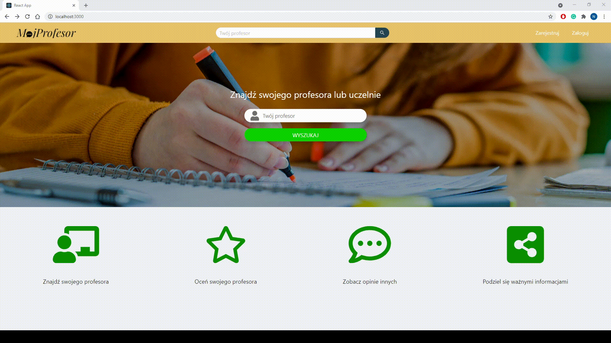
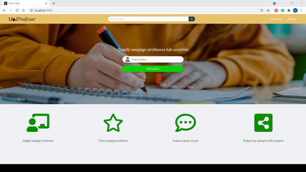
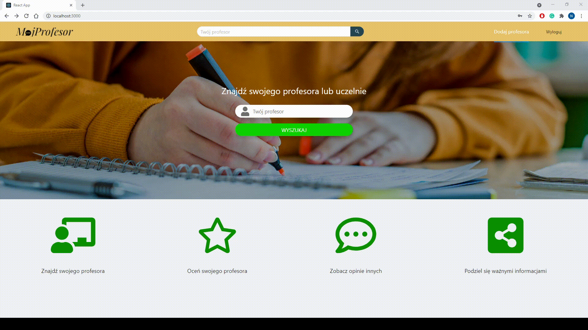

<p align="center"> 
  
</p>
<div align="center">
    <!-- Contributors number -->
    <a></a>
    <!-- Stability -->
    <a>
    </a>
    <!-- NPM version -->
    <a>
    </a>
    <!-- Build Status -->
    <a>
    </a>
    <!-- Standard -->
    <a>
    </a>
</div>
<br>
<h2 align="center"> MójProfesor - wszystkie opinie na temat Twoich Prowadzących! </h2>
<br>
<div align="center">
  <h3>
    <a href="#description">
      Opis projektu
    </a>
    <span> | </span>
    <a href="#functions">
      Funkcjonalności
    </a>
    <span> | </span>
    <a href="#live-demo">
      Demo
    </a>
    <span> | </span>
    <a href="#configuration">
      Konfiguracja
    </a>
    <span> | </span>
    <a href="#folder-structure">
      Struktura projektu
    </a>
    <span> | </span>
    <a href="contributors">
      Kontrybutorzy
    </a>
  </h3>
</div>

<br>

<h2 id="description" style="color: rgb(55,148,255);"> 📝 Opis projektu </h2>

MójProfesor to odnowiona wersja doskonale znanego wszystkim Studentom portalu z opiniami o Prowadzących. Tylko tutaj dowiesz się, z kim będziesz miał zajęcia w następnym semestrze, co na temat Twoich Prowadzących sądzą inni studenci, a także na co zwrócić uwagę podczas nauki i na jakie zajęcia warto się zapisać. 

Masz własne przemyślenia na temat zajęć prowadzonych na Twojej uczelni? Nie zgadzasz się z opiniami dodanymi przez innych Użytkowników? A może chcesz osobiście docenić pracę swojego ulubionego Prowadzącego? Dodaj swoją opinię i pomóż innym Studentom rozwiać swoje wątpliwości!

A kiedy dowiesz się wszystkiego na temat swoich Prowadzących, daj nam znać, czy nasz projekt Ci się spodobał i zostaw gwiazdkę, aby zmotywować nas do dalszej pracy :relaxed:! 

<br>
<h2 id="functions" style="color: rgb(55,148,255);"> 🎯 Fukcjonalności </h2>

<h3> • Wyszukiwanie Profesora </h3>
Aplikacji MójProfesor pozwoli Ci znaleźć Twojego Profesora, bez konieczności rejestracji! Wystarczy, że podasz imię i nazwisko Prowadzącego i już po chwili dowiesz się, jak oceniają go inni Studenci.
<br><span style="color:rgba(0,0,0,0);">.</span>


<h3> • Rejestracja </h3>
Możesz również dołączyć do naszej społeczności i zarejestrować się. Zapewniamy pełną <span style="color: gray">anonimowość</span> 🤫 - przy rejestracji poprosimy Cię jedynie o adres e-mail.
<br><span style="color:rgba(0,0,0,0);">.</span>


<h3> • Logowanie </h3>
Zaloguj się, aby móc korzystać ze wszystkich funkcjonalności naszej aplikacji. E-mail, hasło i... nasza aplikacja jest w pełni do Twojej dyspozycji!
<br><span style="color:rgba(0,0,0,0);">.</span>


<h3> • Dodawanie opinii </h3>
Jako zalogowany Użytkownik możesz podzielić się ze wszystkimi swoją oceną na temat Prowadzących. Tutaj też przypominamy o pełnej <span style="color: gray">anonimowości</span> 🤫!
<br><span style="color:rgba(0,0,0,0);">.</span>


<h3> • Dodawanie Profesora </h3>
Nie znalazłeś swojego Profesora? Nic straconego! Dodaj go do naszej bazy i jako pierwszy dodaj ocenę. Inni Studenci będą ci wdzięczni :wink:!
<br><span style="color:rgba(0,0,0,0);">.</span>


<br>
<h2 id="live-demo" style="color: rgb(55,148,255);"> 🚀 Live demo </h2>

Chcesz już teraz przetestować naszą aplikację? Kliknij <a href="https://moj-profesor.herokuapp.com/">tutaj!</a>

<br>
<h2 id="configuration" style="color: rgb(55,148,255);"> 💻 Uruchomienie projektu </h2>

Aby uruchomić ten projekt musisz wcześniej zainstalować Node.js oraz Docker na swoim komputerze. Następnie wykonaj poniższe kroki:

1. Pobierz repozytorium:

```
git clone https://github.com/bartq98/mojProfesor.git
```

2. Przejdź do folderu z projektem:

```
cd mojProfesor
```

3. Uruchom Dockera:

```
docker-compose up --build --force-recreate -d
```

4. Przejdź do podfolderu `frontend`:

```
cd frontend
```

5. Zainstaluj zależności:

```
npm install
```

6. Uruchom aplikację:

```
npm start
```

7. Uruchom przeglądarkę, wejdź na `localhost:3000` i ciesz się działającą apikacją!

<br>
<h3>Wykorzystywane porty: <h3>

| Service       | Hostname                    | IP         | Ports exposed | Purpose               |
|---------------|-----------------------------|------------|---------------|-----------------------|
| api           | mojprofesor_api_1           | 172.18.0.3 | 7000->80      | Spring-boot API       |
| postgres_db   | mojprofesor_postgres_db_1   | 172.18.0.2 | 6432->5432    | Database              |

<br>
<h3>Dokumentacja backend'u:</h3>

```
http://localhost:7000/swagger-ui/index.html
```
<br>
<h2 id="folder-structure" style="color: rgb(55,148,255)"> 🌵 Struktura projektu </h2>

```
mojProfesor
├───backend
│   ├───.mvn
│   │   └───wrapper
│   ├───src
│   │   ├───main
│   │   │   ├───java
│   │   │   │   └───com
│   │   │   │       └───mojprofesor
│   │   │   │           └───backend
│   │   │   │               ├───configuration
│   │   │   │               │   └───jwt
│   │   │   │               ├───controller
│   │   │   │               ├───entity
│   │   │   │               ├───exception
│   │   │   │               ├───payload
│   │   │   │               ├───repository
│   │   │   │               └───service
│   │   │   └───resources
│   │   └───test
│   │       └───java
│   │           └───com
│   │               └───mojprofesor
│   │                   └───backend
│   └───target
│       ├───classes
│       │   └───com
│       │       └───mojprofesor
│       │           └───backend
│       │               ├───configuration
│       │               │   └───jwt
│       │               ├───controller
│       │               ├───entity
│       │               ├───exception
│       │               ├───payload
│       │               ├───repository
│       │               └───service
│       ├───generated-sources
│       │   └───annotations
│       ├───generated-test-sources
│       │   └───test-annotations
│       ├───maven-status
│       │   └───maven-compiler-plugin
│       │       ├───compile
│       │       │   └───default-compile
│       │       └───testCompile
│       │           └───default-testCompile
│       └───test-classes
│           └───com
│               └───mojprofesor
│                   └───backend
└───frontend
    ├───public
    └───src
        ├───assets
        │   ├───css
        │   └───img
        ├───components
        │   ├───common
        │   │   ├───Input
        │   │   ├───Layout
        │   │   ├───Mark
        │   │   ├───SignedIcon
        │   │   ├───Star
        │   │   ├───StarRating
        │   │   └───Text
        │   ├───login
        │   ├───ProfesorDetails
        │   └───ProfessorsView
        ├───dal
        ├───hooks
        ├───store
        │   └───slices
        ├───typing
        │   └───interfaces
        ├───utils
        │   └───constants
        └───views
```

<br>
<h2 id="contributors" style="color: rgb(55,148,255);"> 👷 Kontrybutorzy </h2>

Projekt współtworzyli studenci trzeciego roku Informatyki na Wydziale Informatyki i Telekomunikacji Politechniki Krakowskiej (<a href="#emoji_key">[oznaczenia]</a>):

<!-- ALL-CONTRIBUTORS-LIST:START - Do not remove or modify this section -->
<!-- prettier-ignore-start -->
<!-- markdownlint-disable -->
<table align="center">
  <tr>
    <td align="center"><a href="https://github.com/JacobChwastek"><br /><sub><b>Jakub Chwastek</b></sub></a><br /><a  title="Leader" href="#leader">:rocket:</a> <a title="Tools" href="#frontend">:pencil2:</a></td>
    <td align="center"><a href="https://github.com/borchowiec"><br /><sub><b>Patryk Borchowiec</b></sub></a><br /><a href="https://avatars.githubusercontent.com/u/28399455?v=4" title="Leader" href="#leader">:rocket:</a> <a title="Tools" href="#backend">:hammer:</a></td>
    <td align="center"><a href="https://github.com/bartq98"><br /><sub><b>Bartek Bieńko</b></sub></a><br /><a title="Leader" href="#leader">:rocket:</a> <a title="Tools" href="#frontend">:pencil2:</a></td>
    <td align="center"><a href="https://github.com/nataliab9910"><br /><sub><b>Natalia Bidzińska</b></sub></a><br /><a title="Tools" href="#frontend">:pencil2:</a> 
    <!-- <a title="Tools">:pencil:</a> -->
    </td>
    <td align="center"><a href="https://github.com/dannn98"><br /><sub><b>Dawid Dąbek</b></sub></a><br /><a title="Tools" href="#backend">:hammer:</a></td>
    <td align="center"><a href="https://github.com/dd0h"><br /><sub><b>Marek Buczek</b></sub></a><br /><a title="Tools" href="#frontend">:pencil2:</a></td>
  </tr>
</table>
<table align="center">
  <tr>
    <td align="center"><a href="https://github.com/VoodooPrograms"><br /><sub><b>Bartosz Belski</b></sub></a><br /><a title="Leader" href="#leader">:rocket:</a> <a title="Tools" href="#devops">:wrench:</a></td>
    <td align="center"><a href="https://github.com/Gladias"><br /><sub><b>Aleksander Dróżdż</b></sub></a><br /><a title="Tools" href="#backend">:hammer:</a></td>
    <td align="center"><a href="https://github.com/dziewonskajolanta"><br /><sub><b>Jolanta Dziewońska</b></sub></a><br /><a title="Tools" href="#backend">:hammer:</a></td>
    <td align="center"><a href="https://github.com/oneirros"><br /><sub><b>Jakub Białoń</b></sub></a><br /><a title="Tools" href="#backend">:hammer:</a></td>
    <td align="center"><a href="https://github.com/festinalentee"><br /><sub><b>Karolina Bieńkowska</b></sub></a><br /><a title="Tools" href="#frontend">:pencil2:</a></td>
  </tr>
</table>

<br>
<div id="emoji_key">
  <h2> 🔑 Oznaczenia:</h2>
  <h3>
    <a id="leader">
      :rocket: - Leader
    </a>
  </h3>
  <h3>
    <a id="backend">
      :hammer: - Backend
    </a>
  </h3>
  <h3>
    <a id="frontend">
      :pencil2: - Frontend
    </a>
  </h3>
  <h3>
    <a id="devops">
      :wrench: - DevOps
    </a>
  </h3>
</div>

<br>
<h1 style="color: rgb(55,148,255);">Koniec! :blue_heart:</h1>
